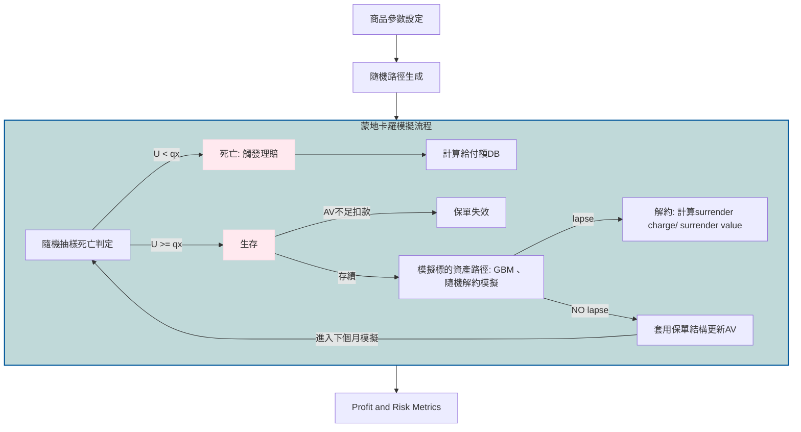
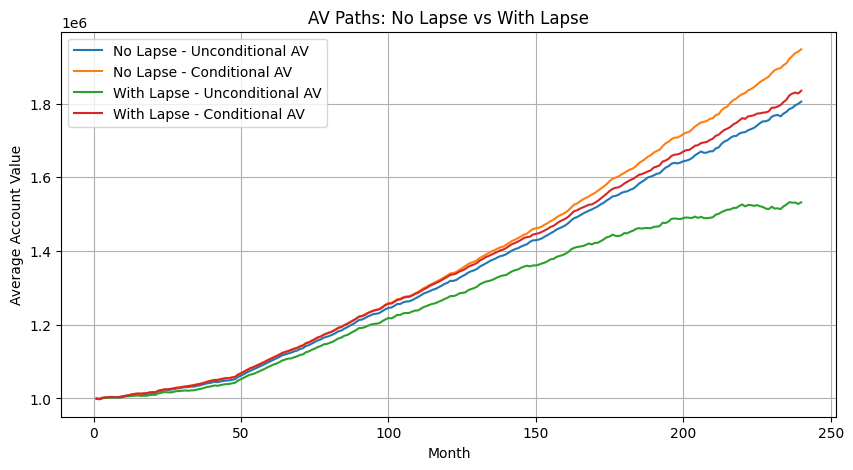
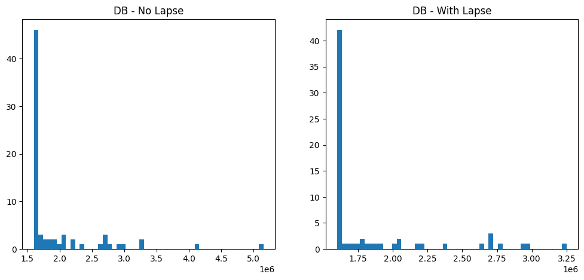
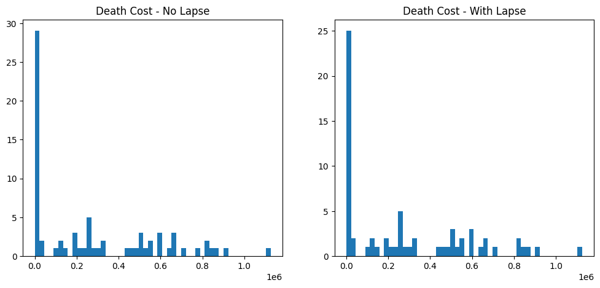
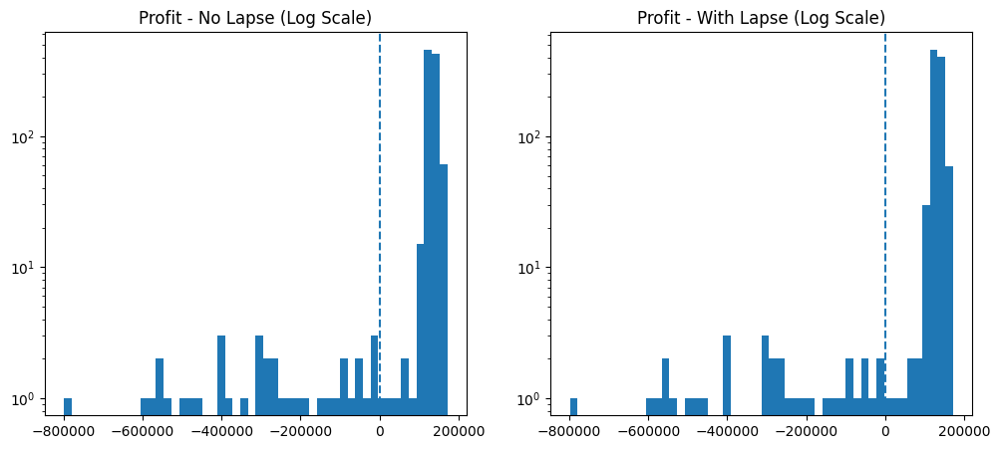

# 📘 投資型保單 GMDB 模擬與解約行為分析

## Unit-Linked Insurance Simulation with GMDB and Dynamic Lapse Behavior

### 📌 專案簡介

本專案建立投資型保單（Unit-Linked Insurance）的 Monte Carlo Simulation 模型，參考實際商品設計，分析保戶解約行為（lapse behavior）對死亡給付、死亡成本與公司獲利的影響。

模型結合三個重要元素:

1. 使用 GBM 模擬投資標的報酬路徑，透過 Monte Carlo 生成帳戶價值（AV）的分布。
2. 參考實際商品保單結構、死亡率與 COI 費率，計算 Death Benefit 與 Death Cost 。
3. 引入動態解約模型（dynamic lapse model），使保戶行為隨帳戶價值、保證水準與市場環境變動。

---
#### 💻 核心程式碼 完整模擬過程與數據分析請參考： [投資型商品模型主程式 (Jupyter Notebook)](./Unit_Linked_Insurance_Product_Simulation.ipynb)
------

### 🎯 目標 : 利用 paired Monte Carlo simulation，在相同市場路徑與死亡隨機數下比較 No Lapse vs With Lapse
分析：
1. Account Value（AV）
2. Death Benefit（DB）
3. Death Cost（DC）
4. PV Profit（NPV）
5. 拆解利潤來源與 tail risk
6. (補充) Scenario-based analysis - 10%、20%、40% lapse rate
---

### 🧩 Model Framework

### Simulation Flow (建議使用白色背景看)

 

< 模型重點 >  
🔹 Monte Carlo + GBM : 模擬投資標的隨機路徑 → 產生 AV 分布  
🔹 GMDB 設計 : DB = max(保證金額, 帳戶價值)  
🔹 Death Cost = max(DB - AV, 0) → 代表公司實際承擔的保證損失  
🔹 Paired Simulation : 同一保戶 / 同一市場路徑 / 同一死亡亂數 → 只改「是否解約」  
🔹 Logistic Model : 基礎解約意願 / Moneyness / 解約費用 / 市場報酬 → 隨機亂數<解約機率 視為解約

 

---
### 📊 模擬結果
#### 1.  No Lapse / With Lapse 模型基本比較
   
(1) Final AV : With lapse（153萬）低於 No lapse（180萬）👉 解約後 AV 補 0 → 拉低整體平均  
(2) Lapse Behavior : With lapse 模型解約率約 9.9%、平均發生於 第 13 年  
(3) Duration :With lapse 較短（227 vs 235 月） 👉 減少收入，同時降低風險暴露期間  
(4) Death Rate : 7.3% → 6.6%  解約使部分保戶提前退出風險池 👉  Unconditional DB / Death Cost 下降

| Metric                             | No Lapse       | With Lapse     |
|:-----------------------------------|---------------:|---------------:|
| Unconditional Final AV             | 1,805,082.3936 | 1,531,913.0913 |
| Conditional Final AV               | 1,947,230.1980 | 1,834,626.4567 |
| Lapse Rate                         | 0.0000         | 0.0990         |
| Avg Lapse Month                    | --             | 155.8788       |
| Duration                           | 234.9920       | 226.9040       |
| Death Rate                         | 0.0730         | 0.0660         |
| Unconditional Death Benefit (Mean) | 140,013.8139   | 120,646.4503   |
| Unconditional Death Cost (Mean)    | 19,930.2081    | 18,286.4170    |

 

---

#### 2.  Conditional Death Benefit vs Death Cost

**Death Benefit（給付金額）**  
-  Mean / Median  
   With lapse 平均 DB 較低 👉 高 AV 保戶提前解約 → 高給付案例減少    
   DB median 皆為 160萬 👉 至少一半案例仍由保證機制主導
-  Tail（P95 / P99 / Max）      
   With lapse 下 P95、P99、Max 右尾明顯下降 👉 DB tail 來自高 AV（好市場），Lapse 移除高 AV 保戶 → 高給付減少  

**Death Cost（實際風險）**      
-  Mean  
   With lapse 略高 👉 解約移除低風險（高 AV）路徑 留下來的死亡案例 AV 較低  
-  Tail（P95 / P99 / Max）    
   With lapse 下P95 / P99：略微上升 Max：兩情境相同 👉 尾端損失未下降

**🔥 Core Insight**  
**1. Death Benefit 下降（高 AV 給付減少）**  
**2. Death Cost 尾端幾乎不變，未降低真正的保證風險**

| Metric   | DB (No Lapse)   | DB (With Lapse)   | Death Cost (No Lapse)   | Death Cost (With Lapse)   |
|:---------|----------------:|------------------:|------------------------:|--------------------------:|
| Mean     | 1,917,997.4506  | 1,827,976.5197    | 273,016.5489            | 277,066.9240              |
| Median   | 1,600,000.0000  | 1,600,000.0000    | 186,248.4303            | 200,121.8030              |
| P95      | 3,079,608.0688  | 2,758,799.2435    | 829,880.3162            | 834,639.8409              |
| P99      | 4,406,276.8821  | 3,067,684.4443    | 972,626.5051            | 987,544.0700              |
| Max      | 5,154,733.7489  | 3,250,789.7456    | 1,126,064.3153          | 1,126,064.3153            |

 

---
#### 3.  PV Profit 分析（Log Scale）

-  Min、P1、P5  
在 no lapse 與 with lapse 下皆相同、P5接近 👉 最極端虧損路徑幾乎相同  
-  Mean     
with lapse 平均 profit 略為右移  

**🔥 Core Insight : 最壞情境（極端虧損）在兩種情境下幾乎相同，代表 lapse 無法消除 joint tail event（市場下跌 + 死亡）， left tail 幾乎未改變**

| Metric       | No Lapse         | With Lapse       |
|:-------------|-----------------:|-----------------:|
| Min          | -798,481.0257    | -798,481.0257    |
| P1           | -402,261.9864    | -402,261.9864    |
| P5           | 109,459.5953     | 105,271.9762     |
| Median       | 132,054.6660     | 131,398.1018     |
| Mean         | 117,115.3022     | 117,467.4978     |
| Total Profit | 117,115,302.2221 | 117,467,497.8194 |

 

**🔍  Outcome Decomposition (將保戶分為三類)**

| case_type              |   n | avg_db_no_lapse   | avg_db_with_lapse   | avg_dc_no_lapse   | avg_dc_with_lapse   | avg_pv_profit_no_lapse   | avg_pv_profit_with_lapse   |
|:-----------------------|----:|------------------:|--------------------:|------------------:|--------------------:|-------------------------:|---------------------------:|
| Same outcome           | 901 | 133,902.83      | 133,902.83        | 20,295.69       | 20,295.69         | 117,100.84             | 117,100.84               |
| Survivor lapsed        |  92 | 0.00            | 0.00              | 0.00            | 0.00              | 128,653.46             | 120,959.61               |
| Death avoided by lapse |   7 | 2,766,766.23    | 0.00              | 234,827.30      | 0.00              | -32,668.12             | 118,764.67               |

1. Same outcome >> (1) 保戶在兩邊皆死亡，且死亡發生在解約前 或 (2) 兩邊都未死亡、with lapse 也沒有解約  
這兩種情況兩模型現金流完全一致， PV profit 沒有任何差異

2. Survivor lapsed   
保戶在兩種情境下皆未死亡( DB & DC = 0)，但 with lapse 下保戶提前解約少收未來管理費與 COI，雖有 surrender charge 作補償，但整體 PV profit 略為下降，顯示對於原本不會產生保證成本的保戶而言，lapse 反而降低公司利潤

3. Death avoided by lapse   
No lapse 原本死亡保戶在 with lapse 下於死亡前提前解約，完全避免DB & DC ，PV profit 轉為正值（118,765），平均提升約 15 萬。這顯示 lapse 的主要價值並非來自解約費收入，而是來自避免少數高損失的死亡情境

**🔥 Core Insight : 本模擬結果 PV profit 提升主要來自 "Death avoided by lapse" 這類機率低但影響重大的事件，但從分布和數值來看影響有限**

 

---

### 📊 解約率情境分析  [scenario-based analysis result (Jupyter Notebook)](./lapse_rate_scenario)

在固定其他參數下調整解約率（10%、20%、40%），觀察其對 PV Profit 的影響。
| Metric          | No Lapse               | Lapse 10%              | Lapse 20%               | Lapse 40%               |
|:----------------|-----------------------:|-----------------------:|------------------------:|------------------------:|
| n               | 1000                   | 1000                   |  1000                   |  1000                   |
| duration        | 234.9920               | 226.9040               |  217.7550               |  196.0630               |
| mean DB         | 1,917,997.4506         | 1,827,976.5197         | 1,799,388.4479          | 1,798,116.6234          |
| mean DC         | 273,016.5489           | 277,066.9240           | 281,887.4748            | 298,002.2793            |
| total pv profit | 117,115,302.2221       | 117,467,497.8194       | 117,513,461.8085        | 116,104,657.5680        |

( lapse 主要降低高 DC 的發生機率，但同時也讓留下來的死亡樣本風險變高形成 selection effect，所以條件 mean DC 反而上升)

**🔥 Core Insight :**  
**1. 中度解約可降低高額死亡成本觸發機率，使獲利獲利**  
**2. 過高解約會因未來費用收入流失，導致整體獲利下降**  
**3. 解約率與利潤呈現非線性關係**  

 

---

### 🔍 核心發現
**1. Lapse 的雙重效果 : 一方面會減少未來費用收入，原本不會發生死亡的保戶提前解約時，可能降低 PV profit；另一方面則使部分保戶提前退出風險池，降低未來死亡給付與保證成本暴露**  
**2. 模型平均 Profit 雖提升但 Tail Risk 不變**  
**3. GMDB 的主要風險來自 : 市場大跌 + 發生死亡（Joint Tail Event）**  
👉 改善 Tail risk 仍需：保證設計 / 費率調整 / Hedging 

 

---
 
⚠️ 模型限制  
1. 單一資產（GBM）/ 年限 20 年  
2. 無 stochastic interest rate  
3. 無 hedging cost  
4. lapse 未校準  

